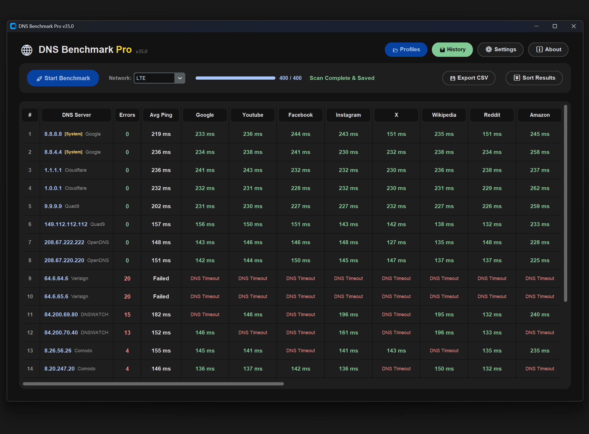

<div align="center">

# 🦅 BlueFalcon DNS Benchmark Pro

**A highly optimized, multi-threaded desktop utility engineered for accurate DNS latency testing, profiling, and network analytics.**


[](https://github.com/bluefalcon2270/bluefalcon-dns-benchmark/releases)
[](LICENSE)
[](https://www.youtube.com/@BlueFalcon2270)

<br />
</div>

A modern, fast dashboard designed to evaluate DNS server performance across multiple domains simultaneously. Craft custom configuration profiles for different networks (ISPs), leverage up to 1,000 concurrent worker threads for instant results, and track historical latency data through the integrated analytics manager. Designed with a sleek Material Design 3 (Google) Dark Theme.



## 🚀 How to Use

**Step 1: Download**
* Navigate to the **Releases** section on the right side of this repository.
* Download the compiled `BlueFalcon_DNS_Benchmark_Pro_v40.0.exe`. No installation is required.

**Step 2: First Launch**
* Place the `.exe` inside a dedicated folder anywhere on your computer.
* Double-click to run. The application will automatically generate a default profile and a `benchmark_history.csv` file in the same directory.

**Step 3: Choose your Workflow**
* **Live Benchmarking:** Select a configuration profile from the top dropdown, pick your current Network, and click **🚀 Start Benchmark**. The app will ping all DNS servers against your target domains and calculate the average latency and failure rates.
* **History Analytics:** Click the **⚙️** (Preferences) icon and navigate to the **History** tab to load aggregated past scans. You can also export current live results to CSV directly from the main dashboard.
* **Profile Management:** Open Preferences to create new profiles, edit your DNS/Domain target lists, and automatically extract/save the fastest working DNS servers from a recent scan into a new "Best" profile.

<br>

## 🌟 Architecture & Features

Built on a modular design pattern to separate networking logic from the UI rendering engine, ensuring the app remains responsive even under heavy thread loads:

* `main.py`: The entry point launcher, configuring the Windows Taskbar AppUserModelID to ensure the custom logo displays correctly on the taskbar.
* `core.py`: Handles network utilities (TCP timeouts, `dnspython` resolving) and the `ConfigManager` for reading/writing local text profiles.
* `gui.py`: The CustomTkinter interface, managing the multi-threaded scanning engine, thread-safe queue processing (throttled to prevent UI hard locks), and data grid rendering via `pandas`.

<br>

## 💻 For Developers

Ensure you are running **Python 3.10+** on Windows.

1. **Clone the repository:**
```cmd
git clone https://github.com/bluefalcon2270/bluefalcon-dns-benchmark.git
cd bluefalcon-dns-benchmark
```

2. **Install dependencies:**
```cmd
pip install customtkinter pandas dnspython
```

3. **Launch Suite:**
```cmd
python main.py
```

### PyInstaller Compilation (.exe)

When packing the modular Python project, point PyInstaller strictly at the entry point. It will analyze the AST and package `core.py` and `gui.py` automatically. The `--add-data` flag ensures the icon is embedded for the taskbar resolver:

```cmd
pyinstaller --noconsole --onefile --icon="icon.ico" --add-data "icon.ico;." --name "BlueFalcon DNS Benchmark Pro v40.0" main.py
```

<br>

## ✅ Supported Systems

* **Windows 11:** Fully Supported 
* **Windows 10:** Fully Supported (Requires PowerShell for system DNS auto-detection)